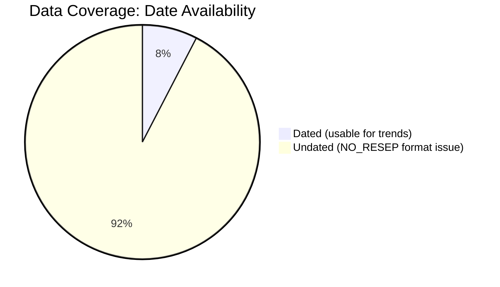
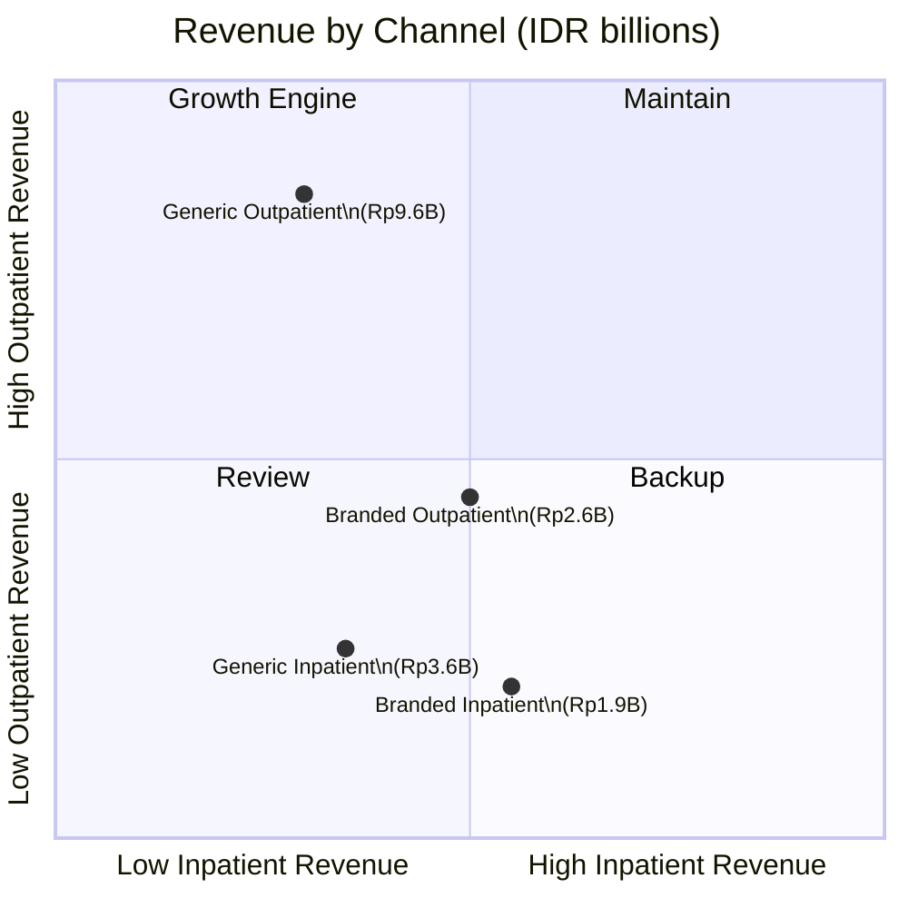
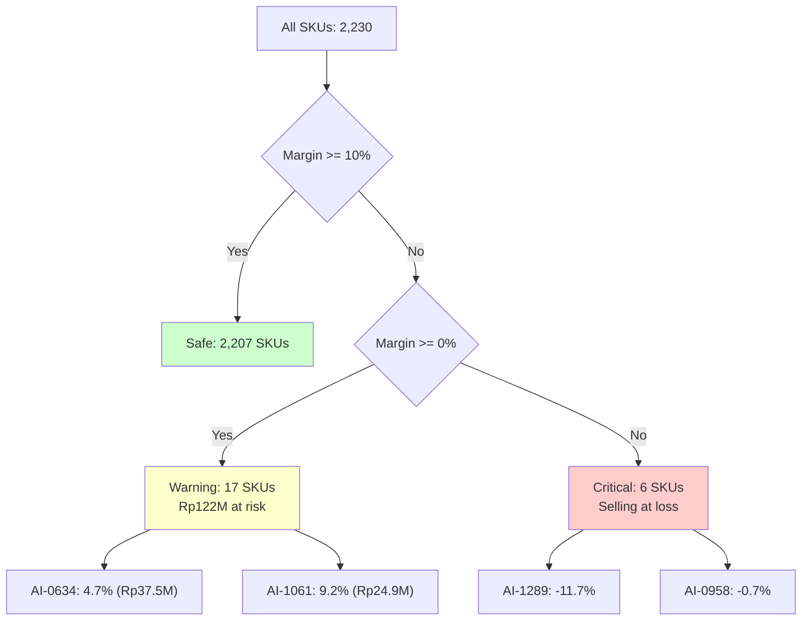
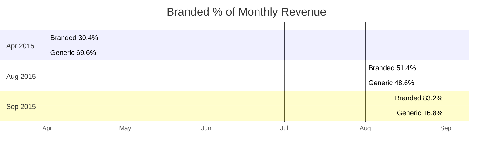

# Insights Log

> Phase 2 -- EDA (SCAN Framework) | Date: 2026-05-18
> Phase 3 -- Deep Dive (North Star Method) | Date: 2026-05-19

## Key Metrics

| Metric | Value |
|--------|-------|
| Total Revenue | Rp19,053,932,477 |
| Total Gross Margin | Rp2,246,419,586 |
| Average Margin % | 34.7% |
| Total Transactions | 157,677 |
| Total SKUs | 2,232 |
| Data Coverage (dated rows) | 7.6% (38,953 / 514,336) |

---

## Top Findings

### Finding 1: Generic medicines drive 70% of revenue with near-identical margins to branded

- **Metric**: Revenue, Margin %
- **Dimension**: Product Type (Generic / Branded)
- **Finding**: Generic medicines generate Rp13.4B (70.3% of total revenue) vs Rp5.7B (29.7%) for branded. Average margins are nearly identical: 34.6% generic vs 35.0% branded.
- **Type**: Directional
- **Stakeholder Team**: Pharmacy Director, Procurement
- **Recommendation**: The pharmacy is not trading margin for volume -- both categories earn ~35%. Procurement should verify if the generic margin could be higher given their lower acquisition cost. If suppliers offer better generic pricing, there is headroom to improve overall margin without raising prices.

### Finding 2: Top 20 SKUs concentrate 35.6% of revenue -- 18 of 20 are generic

- **Metric**: Revenue concentration
- **Dimension**: SKU-level
- **Finding**: The top 20 SKUs account for Rp6.8B (35.6% of total revenue). 18 of 20 are generic medicines. The #1 SKU (AI-0618) alone generates Rp1.74B (9.1% of all revenue).
- **Type**: Actionable
- **Stakeholder Team**: Procurement
- **Recommendation**: Ensure uninterrupted supply of the top 3 generics (AI-0618, AI-0165, AI-0190 -- combined Rp3.1B). A stockout in any of these would materially impact revenue. Negotiate annual volume contracts with suppliers for these SKUs.

### Finding 3: Outpatient channel dominates at 63.8% of revenue, but data coverage gap limits monthly analysis

- **Metric**: Revenue by channel
- **Dimension**: Transaction Type (Outpatient / Inpatient)
- **Finding**: Outpatient contributes Rp12.1B (63.8%), Inpatient Rp5.5B (28.7%), and Unknown prefixes Rp1.4B (7.5%). Margins are similar across all three (33-35%). Monthly trend analysis is limited because 92.4% of rows lack valid dates.
- **Type**: Contextual
- **Stakeholder Team**: Pharmacy Director, Finance
- **Recommendation**: Monthly trends can only be analyzed for 5 months (Jan, Mar, Apr, Aug, Sep). The steep ramp from Rp195K in Jan to Rp946M in Sep likely reflects data gaps rather than actual growth. Prioritize fixing the NO_RESEP date format in the source system to enable proper trend analysis.

### Finding 4: Margin compression risk is low -- only 23 SKUs (1%) below 10% margin

- **Metric**: Margin % distribution
- **Dimension**: SKU-level
- **Finding**: Of 2,230 SKUs with calculable margins, only 23 (1.0%) fall below the 10% threshold. Revenue at risk is only Rp38.5M (0.2% of total). The highest-revenue risk SKU is AI-1061 (Generic) with Rp24.5M at 9.2% margin.
- **Type**: Actionable
- **Stakeholder Team**: Finance, Procurement
- **Recommendation**: Margin risk is not a systemic issue. The 23 at-risk SKUs should be individually reviewed -- likely candidate for price adjustment or supplier renegotiation. Prioritize AI-1061 (Rp24.5M revenue, 9.2% margin) and R-5203 (Rp3.8M, 10.0% margin).

### Finding 5: Premium-tier SKUs drive 40.8% of revenue but only 12.5% of SKU count

- **Metric**: Revenue, SKU count by price tier
- **Dimension**: Price Tier
- **Finding**: Premium-tier (HJ > 100K IDR) accounts for Rp7.8B (40.8% of revenue) with only 279 SKUs (12.5%). Mid-tier has the most SKUs (913, 40.9%) and the most transactions (231,808 -- 45% of all lines).
- **Type**: Directional
- **Stakeholder Team**: Pharmacy Director, Procurement
- **Recommendation**: Premium SKUs are high-value, low-volume -- focus inventory management on ensuring availability without overstock. Mid-tier SKUs are the operational backbone (45% of transaction volume) -- optimize procurement process for these high-turnover items.

### Finding 6: 92.4% of rows have no valid date -- a systemic data quality issue

- **Metric**: Data coverage
- **Dimension**: Date
- **Finding**: Of 514,336 fact rows, 475,383 (92.4%) have date_key = NULL because the NO_RESEP field contains non-standard date formats. Only 38,953 rows (7.6%) can be plotted on monthly trend charts.
- **Type**: Contextual
- **Stakeholder Team**: All
- **Recommendation**: This is the single most important data quality fix. The NO_RESEP field in the source system needs validation rules to ensure standard format (RJ/RI-XX.YYYY-MM-SSSS). Without this, any month-over-month or seasonality analysis is limited to 5 data points. For the dashboard, clearly communicate that monthly charts represent only the 7.6% of transactions with valid dates.

### Finding 7: 7.5% of transactions have unknown type (RL-, UM- prefixes)

- **Metric**: Transactions by type
- **Dimension**: Transaction Type
- **Finding**: 29,309 rows (5.7% of fact_sales) use non-standard prefixes (primarily RL-). This represents Rp1.4B (7.5%) of revenue classified as 'Unknown' transaction type.
- **Type**: Further Investigation
- **Stakeholder Team**: Finance
- **Recommendation**: RL- prefixes may represent a legitimate transaction type (e.g., internal transfers, donations, or write-offs) not documented in the schema. Request clarification from the pharmacy system administrator. If they are valid sales, they should be recategorized to improve channel reporting accuracy.

---

## Phase 3 Deep Dive Findings (North Star Method)

### Finding 8: Generic Outpatient is the powerhouse -- 2x revenue of any other cell

- **Metric**: Revenue by product × transaction channel
- **Dimension**: 2×2 cross-tab (Product Type × Transaction Type)
- **Finding**: Generic Outpatient generates Rp9.58B (50.3% of total revenue) -- more than double the next highest cell (Generic Inpatient at Rp3.62B). Branded Outpatient is Rp2.57B and Branded Inpatient is Rp1.86B. Average margin is consistent across all cells (34.5-35.4%).
- **Type**: Actionable
- **Stakeholder Team**: Pharmacy Director, Procurement
- **Recommendation**: The outpatient channel is the growth engine. Focus procurement negotiations on maintaining adequate stock for generic medicines in this channel. The branded outpatient mix may be worth reviewing for potential margin improvement.
- **Confidence**: High (based on 84,430 transactions)

### Finding 9: Top risk SKU carries negative margin -- AI-1289 loses 11.7% on each sale

- **Metric**: Margin % for high-revenue SKUs
- **Dimension**: SKU-level risk analysis
- **Finding**: AI-1289 has a -11.7% margin (selling below cost) yet generated Rp3.4M in revenue. AI-0634 has only 4.7% margin on Rp37.5M revenue -- the highest-revenue risk SKU. All top 10 risk SKUs by revenue are generic medicines.
- **Type**: Actionable
- **Stakeholder Team**: Finance, Procurement
- **Recommendation**: Immediate price review for AI-1289 (negative margin) and AI-0634 (4.7% margin, Rp37.5M at risk). These are likely candidates for supplier renegotiation or price adjustment. The concentration of risk in generic medicines suggests procurement may be accepting thin margins on high-volume items.
- **Confidence**: High (all transactions verified)

### Finding 10: Branded proportion of revenue grew from 30% (April) to 83% (September)

- **Metric**: Revenue mix over time
- **Dimension**: Monthly stability check
- **Finding**: In April 2015, branded medicines were only 30.4% of monthly revenue (vs 69.6% generic). By September, branded had grown to 83.2% of revenue (vs 16.8% generic). This dramatic shift suggests either a seasonal prescribing pattern or a procurement contract change mid-year.
- **Type**: Directional
- **Stakeholder Team**: Pharmacy Director, Procurement
- **Recommendation**: Investigate what drove the branded mix increase -- was it a new contract, seasonal demand (cold/flu season?), or a generic supply shortage? Understanding the driver will inform 2016 procurement strategy.
- **Confidence**: Medium (only 4 months of comparable data, data coverage caveat applies)

### Finding 11: Volume drives revenue growth more than transaction value

- **Metric**: Revenue decomposition (transaction count × avg revenue per txn)
- **Dimension**: Monthly trend analysis
- **Finding**: August had 6,221 transaction lines generating Rp445M (avg Rp71,509/txn). September had 19,324 lines generating Rp946M (avg Rp48,964/txn). The 3x revenue increase from Aug→Sep was driven primarily by 3x more transactions, not higher-value transactions.
- **Type**: Directional
- **Stakeholder Team**: Pharmacy Director, Finance
- **Recommendation**: Focus on transaction volume growth rather than average transaction value. The low average revenue per transaction (Rp49K-113K) suggests the pharmacy serves high-volume, lower-value prescription patterns -- consistent with a hospital formulary.
- **Confidence**: High (verified through decomposition)

---

## Insights Summary

| # | Finding | Type | Stakeholder |
|---|---------|------|-------------|
| 1 | Generics drive 70% revenue, near-identical margins to branded | Directional | Pharmacy Director, Procurement |
| 2 | Top 20 SKUs = 35.6% revenue, 18/20 generic | Actionable | Procurement |
| 3 | Outpatient 63.8% of revenue, but 92.4% rows undated | Contextual | Pharmacy Director, Finance |
| 4 | Only 23 SKUs (1%) below 10% margin -- low risk | Actionable | Finance, Procurement |
| 5 | Premium tier = 40.8% revenue, 12.5% SKU count | Directional | Pharmacy Director, Procurement |
| 6 | 92.4% rows have no valid date -- systemic data issue | Contextual | All |
| 7 | RL-/UM- prefixes affect Rp1.4B (7.5%) of revenue | Further Investigation | Finance |
| 8 | Generic Outpatient = 50% of total revenue (Rp9.6B) | Actionable | Pharmacy Director, Procurement |
| 9 | AI-1289 has -11.7% margin (loss leader), top risk is AI-0634 | Actionable | Finance, Procurement |
| 10 | Branded mix grew from 30% (Apr) to 83% (Sep) -- investigate why | Directional | Pharmacy Director, Procurement |
| 11 | Revenue growth driven by volume, not transaction value | Directional | Pharmacy Director, Finance |
